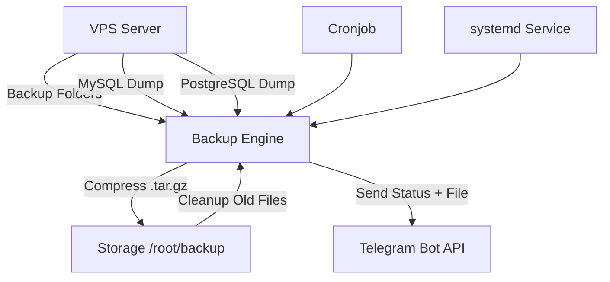

# 📦 **bot-backup-vps-script**


---

# 🛡 **Bot Backup VPS – Telegram Notifier**

Script backup otomatis untuk VPS yang Anda kontrol, dengan fitur canggih:

### ✨ Fitur Utama

* 🔥 **Multi-folder backup** (bisa backup banyak folder sekaligus)
* 🔥 **Backup otomatis database MySQL & PostgreSQL**
* 🔥 **Notifikasi Telegram** (status sukses/gagal)
* 🔥 **Service systemd (daemon)** → berjalan otomatis 24/7
* 🔥 **Cron backup otomatis**
* 🔥 **Auto-clean retention backup** (agar tidak menumpuk)
* 🔥 **Konfigurasi mudah tanpa edit manual**
* 🔥 **Installer otomatis dengan curl**
* 🔥 **Auto-delete installer setelah selesai**

---

# 🚀 **Instalasi Cepat**

Cukup satu perintah:

```bash
bash <(curl -s https://raw.githubusercontent.com/heruhendri/bot-backup-vps-script/master/install-backupvps-telegram.sh)
```

Installer akan menanyakan:

* Folder yang ingin di-backup (bisa lebih dari satu)
* Bot Token Telegram
* Chat ID Telegram
* Mengaktifkan MySQL backup?
* Mengaktifkan PostgreSQL backup?
* Retention (berapa hari backup disimpan)
* Cron schedule (jam & menit)
* Timezone server
* Service systemd akan dibuat otomatis

---

# 🧠 **Arsitektur Backup System**

Berikut diagram arsitektur:



Diagram ini menunjukkan:

* Server melakukan backup folder + database
* Dicompress → disimpan → dikirim ke Telegram
* Cron + systemd memastikan selalu berjalan

---

# 📝 **Penjelasan Script Utama**

### 1️⃣ **Konfigurasi & Input User**

Installer meminta informasi penting seperti:

* Token bot Telegram
* Chat ID
* Folder yang ingin di-backup
* Apakah ingin backup MySQL/Postgres
* Timezone
* Jadwal cron

Konfigurasi disimpan di:

```
/opt/auto-backup/config.conf
```

---

### 2️⃣ **Backup Multi-Folder**

Semua folder yang dimasukkan user akan diproses satu per satu:

* Di-zip (`tar.gz`)
* Digabung dalam satu paket

---

### 3️⃣ **Backup Database**

Jika diaktifkan:

#### 🔹 MySQL

```
mysqldump --all-databases
```

#### 🔹 PostgreSQL

```
pg_dumpall
```

---

### 4️⃣ **Notifikasi Telegram**

Mengirim:

* File backup
* Status sukses/gagal
* Informasi ukuran file
* Informasi timestamp

---

### 5️⃣ **Retention Auto Clean**

Backup lama dihapus otomatis:

```
find /root/backup -mtime +RETENTION -exec rm -f {} \;
```

---

### 6️⃣ **Systemd Service (Daemon Mode)**

Service otomatis dibuat:

```
/etc/systemd/system/auto-backup.service
```

Service berjalan otomatis setiap boot dan dapat dicek via:

```
systemctl status auto-backup
```

---

### 7️⃣ **Cron Scheduling**

Backup dilakukan otomatis pada jam yang dipilih user.

---

### 8️⃣ **Installer Self-Delete**

Setelah instalasi berhasil, file akan menghapus dirinya:

```
rm -f install-backupvps-telegram.sh
```

---

# 🔧 Mengontrol Service

### Start service

```
systemctl start auto-backup
```

### Stop service

```
systemctl stop auto-backup
```

### Restart

```
systemctl restart auto-backup
```

### Cek status

```
systemctl status auto-backup
```

---

# 📂 Lokasi File

| Jenis           | Lokasi                                    |
| --------------- | ----------------------------------------- |
| Config          | `/opt/auto-backup/config.conf`            |
| Script utama    | `/opt/auto-backup/backup.sh`              |
| Folder backup   | `/root/backup/`                           |
| Systemd service | `/etc/systemd/system/auto-backup.service` |

---

# 🙌 Kontribusi

Pull request & issue sangat dipersilakan!
Repository:
👉 **[https://github.com/heruhendri/bot-backup-vps-script](https://github.com/heruhendri/bot-backup-vps-script)**

---

# 📜 Lisensi

MIT License.

---


## Penjelasan singkat

* Installer membuat `/opt/auto-backup` berisi:

  * `config.conf` (tanpa password terbuka)
  * `mysql.conf` / `pg.conf` (permission 600) bila diisi
  * `bin/backup-runner.sh` — script yang melakukan dump, mengcompress, menghapus backup lama, mengirim Telegram
* Systemd:

  * `auto-backup.service` menjalankan runner (oneshot)
  * `auto-backup.timer` menjadwalkan service sesuai `OnCalendar` yang Anda berikan
* Logging ke `/var/log/auto-backup.log` dan juga ke `journalctl -u auto-backup.service`

## Tips & Troubleshooting

* Pastikan `curl`, `tar`, `mysqldump` (untuk MySQL), `pg_dump`/`pg_dumpall` (untuk Postgres) terpasang bila diperlukan.
* Untuk melihat log: `sudo journalctl -u auto-backup.service --no-pager` atau `tail -n 100 /var/log/auto-backup.log`
* Jika Anda ingin mengganti jadwal: edit `/etc/systemd/system/auto-backup.timer` lalu `sudo systemctl daemon-reload && sudo systemctl restart auto-backup.timer`
* Jika ingin menambahkan folder baru, edit `/opt/auto-backup/config.conf` (ubah FOLDERS_RAW) dan restart timer/service as needed.

---


