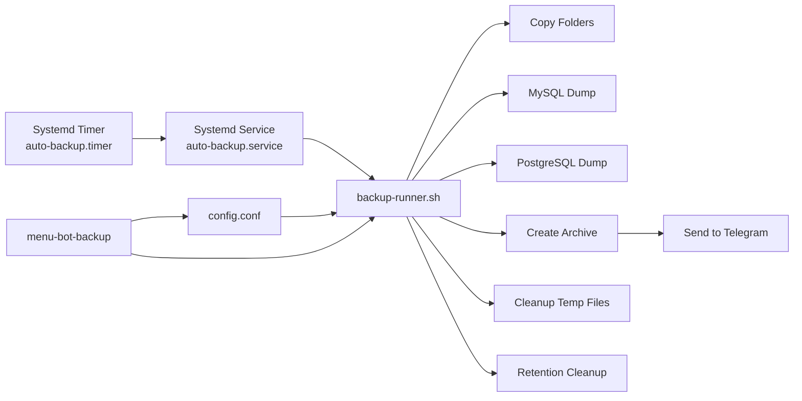
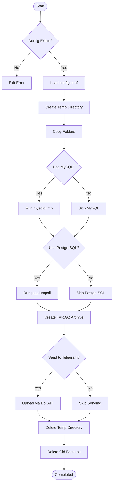

## Ringkasan
Script ini melakukan hal utama berikut:
- Mengumpulkan input (TOKEN Bot, CHAT_ID, daftar folder, opsi MySQL/Postgres, timezone, jadwal).
- Menyimpan konfigurasi aman di `/opt/auto-backup/config.conf`.
- Membangun `backup-runner` yang: menyalin folder, melakukan `mysqldump`/`pg_dumpall` bila perlu, meng-archive, mengirim ke Telegram, dan membersihkan file lama sesuai `RETENTION_DAYS`.
- Membuat systemd unit (`auto-backup.service` + `auto-backup.timer`) untuk penjadwalan.
- Menginstal `menu-bot-backup` (menu interaktif di `/opt/auto-backup/menu.sh`) untuk manajemen rutin (edit config, test backup, restore, dsb).
- Menyertakan perintah rebuild, encrypt, restore dan live status monitor.

---

## Struktur file setelah instalasi
```
/opt/auto-backup/
├─ config.conf          # konfigurasi (chmod 600)
├─ backup-runner.sh     # script yang dijalankan systemd (executable)
├─ menu.sh              # menu PRO (executable)
├─ backups/             # tempat menyimpan file backup (.tar.gz, .zip)
└─ tmp-*                # temp runtime (dibuat/hapus oleh runner)
 
/etc/systemd/system/
├─ auto-backup.service
└─ auto-backup.timer
```

---

## Penjelasan komponen (detail)
### Installer utama
- Path: (file installer yang kamu jalankan)
- Fungsinya:
  - Membuat direktori `/opt/auto-backup` dan set permission.
  - Meminta input user atau membaca config yang ada.
  - Menulis `config.conf` dengan permission `600`.
  - Membuat `backup-runner.sh`, `menu.sh`, `systemd` unit, dan mengaktifkan timer/service.

### config.conf
Disimpan sebagai:
```bash
BOT_TOKEN="..."
CHAT_ID="..."
FOLDERS_RAW="/etc,/var/www"
USE_MYSQL="y"
MYSQL_MULTI_CONF="user:pass@host:db1,db2;user2:pass2@localhost:all"
USE_PG="y"
RETENTION_DAYS="30"
TZ="Asia/Jakarta"
INSTALL_DIR="/opt/auto-backup"
```
- `MYSQL_MULTI_CONF` format: entries dipisah `;`  
  tiap entry: `user:pass@host:dblist`  
  `dblist` = `all` atau `db1,db2`

### backup-runner.sh
- Membaca config, membuat temp dir, menyalin folder (cp -a), melakukan dump MySQL/MySQL-all sesuai `MYSQL_MULTI_CONF`, melakukan `pg_dumpall` jika diaktifkan.
- Mengemas hasil di `backups/backup-YYYY-MM-DD-HHMM.tar.gz`.
- Mengirim ke Telegram menggunakan API `sendDocument`.
- Menghapus temp, dan menghapus backup lebih tua dari `RETENTION_DAYS`.

**Catatan keamanan**: `config.conf` berisi credential DB. Pastikan permission `600`, dan akses server dibatasi.

### systemd unit & timer
- `auto-backup.service` menjalankan `backup-runner.sh` sekali ketika dipanggil.
- `auto-backup.timer` menggunakan `OnCalendar=` (format systemd `OnCalendar`, contoh: `*-*-* 03:00:00` untuk setiap hari jam 03:00).
- Installer men-enable timer dan mulai `--now`.

### menu-bot-backup (menu.sh)
Fitur:
- Lihat/edit config, tambah/hapus folder, tambah/edit/hapus MySQL config
- Edit PostgreSQL settings & uji `pg_dumpall`
- Ubah timezone / retention / jadwal
- Test backup manual
- Restore dari backup (preview isi archive lalu extract ke temp dan rsync ke `/` jika konfirmasi)
- Encrypt latest backup (zip with password, membutuhkan `zip`)
- Rebuild installer files
- Status realtime (monitor timer/service + progress bar sederhana via journalctl)

---

## Diagram Arsitektur & Flowchart (Mermaid — cocok untuk GitHub)
> Salin blok `mermaid` di bawah ke README/GitHub untuk render diagram.

### Arsitektur (high level)


### Flowchart proses backup (runner)


---

## Cara Pasang (Install) — langkah cepat
> Jalankan sebagai `root` atau menggunakan `sudo` di distro berbasis systemd (Ubuntu/Debian/CentOS modern)

1. Upload script installer ke VPS (mis. `install-backup.sh`), beri executable:
```bash
chmod +x install-backup.sh
sudo ./install-backup.sh
```
2. Ikuti prompt: masukkan `BOT_TOKEN` (dapat dari BotFather), `CHAT_ID` (gunakan `@userinfobot` atau kirim pesan ke bot dan lihat update), folder yang dibackup, opsi DB, timezone, dan OnCalendar.
3. Installer akan:
   - Menulis `/opt/auto-backup/config.conf`
   - Membuat runner & menu
   - Mengaktifkan systemd timer & service
   - Menjalankan backup pertama (test)
   - Menghapus file installer (`rm -- "$0"`)

4. Buka menu:
```bash
menu-bot-backup
```

---

## Cara Menguji Manual
- Untuk test run:
```bash
sudo bash /opt/auto-backup/backup-runner.sh
```
- Untuk melihat status timer/service:
```bash
systemctl status auto-backup.timer
systemctl status auto-backup.service
systemctl list-timers --all | grep auto-backup.timer
journalctl -u auto-backup.service -n 100 --no-pager
```
- Untuk mengedit config:
```bash
sudo nano /opt/auto-backup/config.conf
# lalu jalankan:
sudo systemctl daemon-reload
sudo systemctl restart auto-backup.timer
```

---

## Restore dari backup (via menu)
1. Jalankan `menu-bot-backup` → pilih `Restore dari backup`
2. Pilih file (preview pertama 30 baris)
3. Konfirmasi 2x sebelum menimpa file di `/` — karena proses akan `rsync -a --delete` dari temp ke root.
4. Jika ingin manual:
```bash
# extract ke temp
mkdir /tmp/restore && tar -xzf /opt/auto-backup/backups/backup-...tar.gz -C /tmp/restore
# tinjau dulu, lalu pilih method restore yang aman
```

---

## Keamanan & Best Practices
- **Jangan** commit `config.conf` ke GitHub karena mengandung credential.
- Pastikan permission `600` untuk `config.conf`:
```bash
chmod 600 /opt/auto-backup/config.conf
chown root:root /opt/auto-backup/config.conf
```
- Batasi akses SSH ke VPS.
- Gunakan akun database yang minimal haknya (read-only jika memungkinkan untuk dump).
- Jika perlu, gunakan *encrypted transfer* (mis. upload ke S3 dengan server-side encryption) — skrip saat ini hanya mengirim ke Telegram.

---

## Troubleshooting (kasus umum)
- **Backup tidak terkirim ke Telegram**: periksa `BOT_TOKEN`/`CHAT_ID`, periksa response `curl` di `journalctl`.
- **mysqldump gagal**: pastikan `mysqldump` terinstall, host reachable, dan credential benar.
- **pg_dumpall gagal**: pastikan `postgres` user ada dan `pg_dumpall` terinstall; pada beberapa distro perlu run sebagai `postgres`.
- **Timer tidak jalan**: `systemctl daemon-reload` lalu `systemctl enable --now auto-backup.timer`.
- **Installer menghapus dirinya**: script installer menghapus file installer setelah selesai. Simpan salinan jika mau.

---

## Contoh .gitignore (jangan commit secrets)
```
/opt/
/etc/systemd/system/auto-backup.service
/etc/systemd/system/auto-backup.timer
config.conf
*.key
*.pem
```

---

## Cara publish ke GitHub (singkat)
```bash
git init
git add install-backup.sh README.md menu.sh backup-runner.sh
git commit -m "Add auto-backup installer + README"
gh repo create my-auto-backup --public --source=. --remote=origin
git push -u origin main
```
> **PENTING**: jangan tambah `config.conf` ke repo. Buat `config.example` tanpa isi credential sebagai referensi.

---

## Contoh `config.example`
```bash
BOT_TOKEN=""
CHAT_ID=""
FOLDERS_RAW="/etc,/var/www"
USE_MYSQL="n"
MYSQL_MULTI_CONF=""
USE_PG="n"
RETENTION_DAYS="30"
TZ="Asia/Jakarta"
INSTALL_DIR="/opt/auto-backup"
```

---

## Lisensi
Pasang lisensi yang kamu mau (mis. MIT) di file `LICENSE`.

---

## Catatan pengembang / checklist release
- [ ] Buat `config.example` di repo (tanpa credential)
- [ ] Tambah `install.sh` wrapper (opsional)
- [ ] Document release notes & contoh `OnCalendar` strings
- [ ] Tambah test CI (opsional — lint shell)

---

## Kontak
Script dibuat oleh **HENDRI** — support: https://t.me/GbtTapiPngnSndiri

---

**Selesai.**  
Kalau mau, aku bisa:
- Buat file `config.example` & `.gitignore` langsung.
- Pisahkan `menu.sh` dan `backup-runner.sh` menjadi file terpisah untuk repo.
- Menghasilkan gambar PNG dari diagram Mermaid (atau file `.svg`) dan menambahkannya ke repo.
Beritahu aku pilihanmu, Hendri.
````
