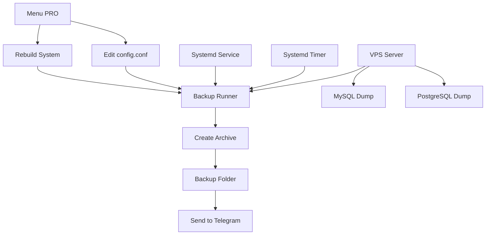
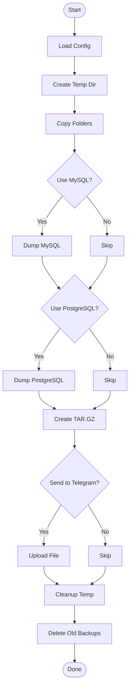

# 📦 **bot-backup-vps-script**


---

# 🛡 **Bot Backup VPS — Telegram Auto Backup (Installer + Menu PRO)**

Script ini membuat sistem **backup otomatis VPS** dengan fitur lengkap:

* Backup folder
* Backup MySQL (multi-host, multi-user, multi-database)
* Backup PostgreSQL
* Notifikasi Telegram (sendDocument)
* systemd service + timer (OnCalendar)
* Menu PRO untuk edit konfigurasi
* Status real-time (auto refresh setiap 1 detik)
* Restore backup → langsung ke root `/`
* Rebuild sistem service/timer/runner
* Encrypt backup (ZIP + password)
* Auto delete file lama (retention)

---

# ✨ **FITUR UTAMA**

### 🔥 Backup Lengkap dan Fleksibel

* Backup banyak folder sekaligus (comma separated)
* MySQL multi config:

  * multi user
  * multi host
  * database ALL atau list DB
  * format: `user:pass@host:db1,db2`
* PostgreSQL full backup (`pg_dumpall`)

### 🔔 Notifikasi Telegram

* Backup dikirim ke Telegram sebagai file
* Caption otomatis

### ⚙️ Otomatis dan Stabil

* Menggunakan systemd service + timer
* Jadwal memakai format OnCalendar
* Timezone di-set otomatis saat instalasi

### 🛠 Menu PRO

Script menyediakan menu canggih:

```
menu-bot-backup
```

Di dalamnya ada:

* Edit BOT TOKEN / CHAT ID
* Tambah / hapus folder
* Tambah / edit / hapus MySQL config
* Edit PostgreSQL + test dump
* Edit timezone
* Edit retention
* Edit jadwal OnCalendar
* Test backup langsung
* Restore dari backup
* Encrypt latest backup
* Rebuild service / timer / runner
* Status statis
* Status realtime (refresh per detik)
* Save config
* Restart service & timer

### 🔒 Keamanan

* Config disimpan di `/opt/auto-backup/config.conf`
* Permission otomatis `chmod 600`
* Password tidak ditampilkan saat input

---

# 🚀 **INSTALASI CEPAT**

Jalankan installer:

```bash
bash <(curl -s https://raw.githubusercontent.com/heruhendri/Installer-Backup-Vps-Bot-Telegram/backup-mongo/install-backupvps-telegram.sh)
```

<!-- Atau versi branch (menu realtime):

```bash
bash <(curl -s https://raw.githubusercontent.com/heruhendri/Installer-Backup-Vps-Bot-Telegram/menu-status-realtime/install-backupvps-telegram.sh)
``` -->

Installer akan menanyakan:

* Bot token
* Chat ID
* Folder backup
* MySQL? (y/n)
* PostgreSQL? (y/n)
* Multi konfigurasi MySQL
* Retention (hari)
* Timezone
* Jadwal systemd timer (OnCalendar)

Setelah selesai:

- ✔ Service dibuat — `auto-backup.service`
- ✔ Timer aktif — `auto-backup.timer`
- ✔ Backup pertama langsung berjalan
- ✔ Installer menghapus dirinya sendiri

---

# 🛠 **UPDATE KONFIGURASI (MENU PRO)**

Akses menu:

```bash
menu-bot-backup
```

Menu lengkap:

```
1) Lihat konfigurasi
2) Edit BOT TOKEN
3) Edit CHAT ID
4) Tambah folder backup
5) Hapus folder backup
6) Tambah konfigurasi MySQL
7) Edit konfigurasi MySQL
8) Hapus konfigurasi MySQL
9) Edit PostgreSQL settings + test dump
10) Ubah timezone
11) Ubah retention days
12) Ubah jadwal OnCalendar
13) Test backup sekarang
14) Restore dari backup
15) Rebuild installer files
16) Encrypt latest backup
17) Restart service & timer
18) Save config
19) Status statis
20) Status realtime
0) Keluar
```

---

# 🧠 **ARSITEKTUR BACKUP SYSTEM**


---
# 🚲 **ALUR BACKUP SYSTEM**


---

# 📂 **STRUKTUR DIREKTORI**

| Path                                      | Deskripsi                               |
| ----------------------------------------- | --------------------------------------- |
| `/opt/auto-backup/config.conf`            | File konfigurasi utama                  |
| `/opt/auto-backup/backup-runner.sh`       | Script inti backup                      |
| `/opt/auto-backup/menu.sh`                | Menu PRO                                |
| `/usr/bin/menu-bot-backup`                | Symlink global ke menu                  |
| `/opt/auto-backup/backups/`               | Folder hasil backup                     |
| `/etc/systemd/system/auto-backup.service` | Service backup                          |
| `/etc/systemd/system/auto-backup.timer`   | Timer OnCalendar                        |
| `install-backupvps-telegram.sh`           | Installer (auto delete setelah selesai) |

---

# 📝 **PENJELASAN SCRIPT UTAMA**

## 1️⃣ **Installer (`install-backupvps-telegram.sh`)**

Fungsi:

* Input seluruh parameter backup
* Buat folder installer
* Buat config
* Buat backup-runner
* Buat systemd service
* Buat systemd timer
* Install menu PRO
* Jalankan backup pertama
* Hapus installer otomatis

## 2️⃣ **Menu PRO (`menu.sh`)**

Fungsi besar:

### 👍 Management Backup Folder

* tambah
* hapus

### 👍 Management MySQL

* multi konfigurasi
* edit & delete
* format:
  `user:password@host:DB1,DB2`
  atau `all`

### 👍 PostgreSQL

* enable/disable
* test dump otomatis

### 👍 Management Sistem

* timezone
* retention
* jadwal OnCalendar

### 👍 Rebuild System

* perbaiki runner
* rebuild service
* rebuild timer

### 👍 Backup & Restore

* test backup
* restore ke `/`
* preview isi archive

### 👍 Status

* status biasa
* status realtime (auto refresh 1 detik)

## 3️⃣ **Backup Runner (`backup-runner.sh`)**

Melakukan:

* backup folder
* backup mysql multi config
* backup postgres
* compress tar.gz
* kirim ke Telegram
* delete tempo
* delete file lama sesuai retention

---

# 🧪 **TEST SERVICE**

Cek service:

```
systemctl status auto-backup
```

Jalankan manual:

```
systemctl start auto-backup
```

Cek timer:

```
systemctl list-timers | grep auto-backup
```

---

# 🧹 **RETENTION AUTO CLEAN**

Backup lama dibersihkan otomatis menggunakan:

```
find /opt/auto-backup/backups -type f -mtime +RETENTION_DAYS -delete
```

---

# 🔐 **ENCRYPT BACKUP (ZIP + PASSWORD)**

Menu PRO menyediakan:

```
Encrypt latest backup
```

Menghasilkan file:

```
backup-xxx.zip
```

---

# 🩹 **RESTORE BACKUP**

Menu PRO:

```
Restore dari backup
```

Fitur:

* pilih file
* preview isi (30 baris)
* extract ke temp
* rsync ke root (`/`)
* konfirmasi dua kali

---

# 🙌 **KONTRIBUSI**

Pull Request dan Issue sangat diterima.

Repo:
👉 [https://github.com/heruhendri/bot-backup-vps-script](https://github.com/heruhendri/bot-backup-vps-script)

---

# 📜 **LISENSI**

MIT License.

