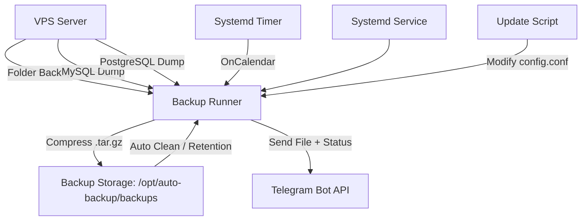

# 📦 **bot-backup-vps-script**


---

# 🛡 **Bot Backup VPS — Telegram Notifier**

Backup otomatis **folder + database** ke **Telegram**, berjalan sebagai **systemd service**, dan memiliki fitur **update konfigurasi** menggunakan menu interaktif.

---

# ✨ **Fitur Utama**

### 🔥 Backup Lengkap

* Multi-folder (banyak path sekaligus)
* MySQL (multi-database atau ALL)
* PostgreSQL (pg_dumpall)

### 🔔 Notifikasi Telegram

* File backup terkirim langsung
* Status sukses / gagal

### ⚙️ Otomatis & Stabil

* systemd service + timer
* Cron schedule menggunakan `OnCalendar`
* Timezone dapat disesuaikan
* Retention auto-clean (hapus backup lama)

### 🛠 Konfigurasi Lengkap

* Installer otomatis (curl)
* Menu **edit**, **hapus**, **tambah backup baru** tanpa menghapus config lama
* Update script tanpa install ulang

### 🔒 Keamanan

* Password database tidak ditampilkan
* Folder konfigurasi di `/opt/auto-backup` aman

---

# 🚀 **INSTALASI CEPAT**

Cukup jalankan:

```bash
bash <(curl -s https://raw.githubusercontent.com/heruhendri/Installer-Backup-Vps-Bot-Telegram/master/install-backupvps-telegram.sh)
```

Installer akan menanyakan:

* Token bot Telegram
* Chat ID
* Folder yang ingin dibackup
* Backup MySQL? (optional)
* Backup PostgreSQL? (optional)
* Daftar database MySQL (all / comma separated)
* Retention days
* Timezone
* Jadwal backup (systemd timer format)

Setelah selesai:

* Service dibuat → `auto-backup.service`
* Timer dibuat → `auto-backup.timer`
* Installer otomatis menghapus dirinya

---

# 🛠 **UPDATE KONFIGURASI (Tambah / Edit / Hapus)**

Update dilakukan melalui script:

```
update-backup.sh
```

Jalankan:

```bash
bash <(curl -s https://raw.githubusercontent.com/heruhendri/Installer-Backup-Vps-Bot-Telegram/master/update-backup.sh)
```

Menu yang tersedia:

```
1. Tambah folder backup
2. Hapus folder backup
3. Tambah database MySQL
4. Hapus database MySQL
5. Ubah jadwal backup
6. Ubah retention
7. Ubah timezone
8. Tampilkan konfigurasi
9. Keluar
```

### Semua update otomatis:

* ✔ Mengubah config file
* ✔ Reload systemd
* ✔ Timer restart

Tidak perlu install ulang dan konfigurasi tidak hilang.

---

# 🧠 **ARSITEKTUR BACKUP SYSTEM**



Penjelasan:

* Semua pekerjaan backup diproses oleh `backup-runner.sh`
* Service & Timer memastikan backup berjalan otomatis
* Telegram menerima file + laporan
* Update konfigurasi tidak menghapus setup lama

---

# 📂 **STRUKTUR DIREKTORI**

| File / Folder                             | Deskripsi               |
| ----------------------------------------- | ----------------------- |
| `/opt/auto-backup/config.conf`            | Konfigurasi utama       |
| `/opt/auto-backup/backup-runner.sh`       | Core backup script      |
| `/opt/auto-backup/backups/`               | Folder hasil backup     |
| `/etc/systemd/system/auto-backup.service` | Service backup          |
| `/etc/systemd/system/auto-backup.timer`   | Scheduler backup        |
| `install-backupvps-telegram.sh`           | Installer               |
| `update-backup.sh`                        | Script edit konfigurasi |

---

# 📝 **PENJELASAN SCRIPT UTAMA**

---

## 1️⃣ **installer — install-backupvps-telegram.sh**

Installer melakukan:

1. Mengambil input dari user
2. Membuat folder `/opt/auto-backup`
3. Membuat `config.conf`
4. Membuat `backup-runner.sh`
5. Membuat systemd service + timer
6. Test backup pertama
7. Menghapus file installer

Setelah instalasi:

* ✔ Tidak perlu jalankan ulang installer
* ✔ Seluruh konfigurasi tersimpan

---

## 2️⃣ **update-backup.sh — menu konfigurasi**

Memiliki fitur:

* Add folder
* Remove folder
* Add MySQL DB
* Remove MySQL DB
* Update Cron schedule
* Update retention
* Update timezone
* View config

Aman karena:

✔ Tidak menimpa konfigurasi lama
✔ Hanya mengubah bagian tertentu
✔ Reload systemd otomatis

---

## 3️⃣ **backup-runner.sh — inti backup**

Fungsi:

* Backup folder
* Dump MySQL (per DB / all)
* Dump PostgreSQL
* Compress → tar.gz
* Upload ke Telegram
* Cleanup file sementara
* Retention auto delete

---

# 📌 **RETENTION AUTO CLEAN**

Backup lama dibersihkan:

```bash
find "$BACKUP_DIR" -type f -mtime +$RETENTION_DAYS -delete
```

---

# 🧪 **TEST SERVICE**

Cek status:

```
systemctl status auto-backup
```

Manual jalankan:

```
systemctl start auto-backup
```

Cek timer:

```
systemctl list-timers | grep auto-backup
```

---

# 🙌 **KONTRIBUSI**

Pull request & issue sangat welcome!

👉 [https://github.com/heruhendri/bot-backup-vps-script](https://github.com/heruhendri/bot-backup-vps-script)

---

# 📜 **LISENSI**

MIT License.

---

